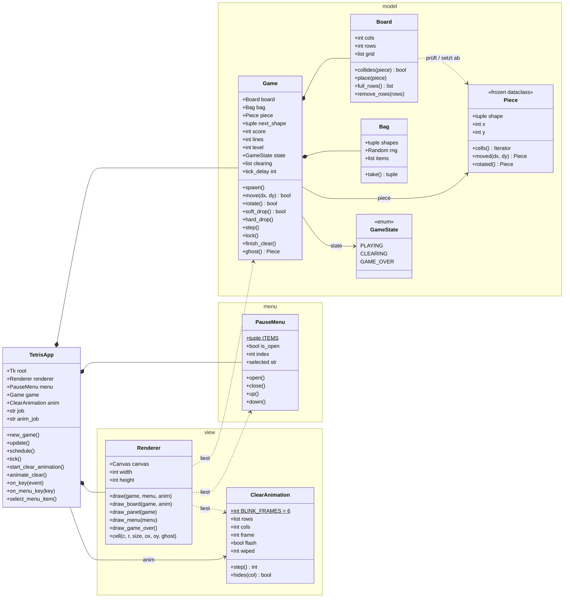
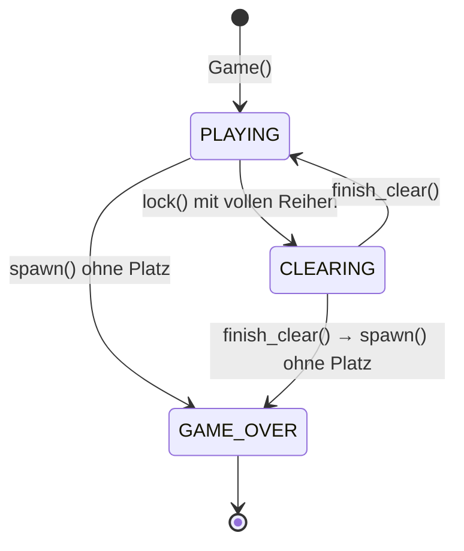
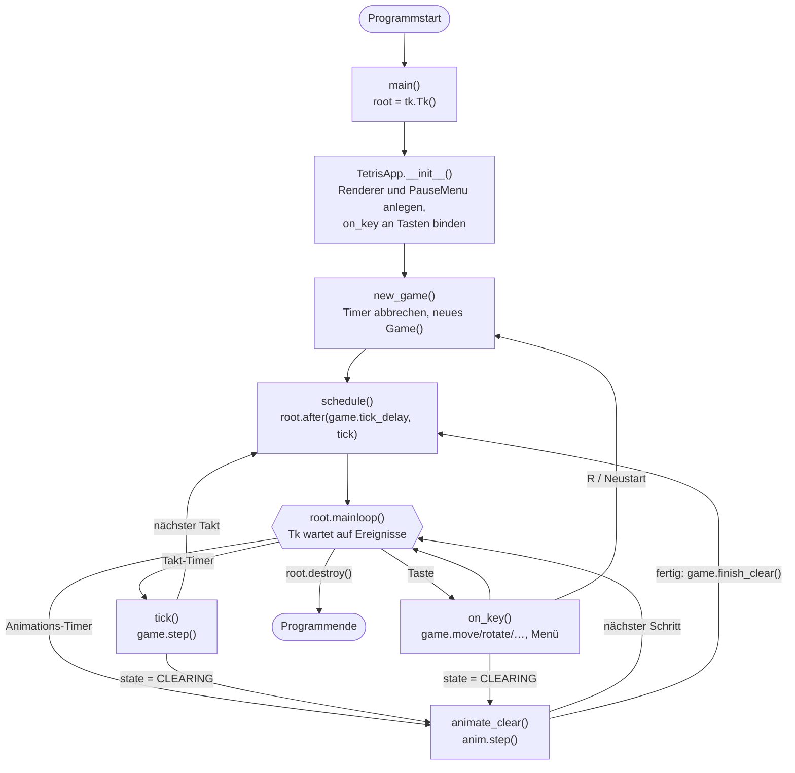
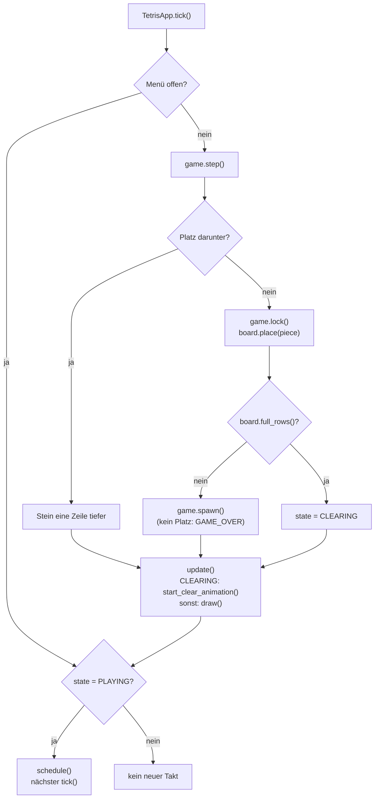
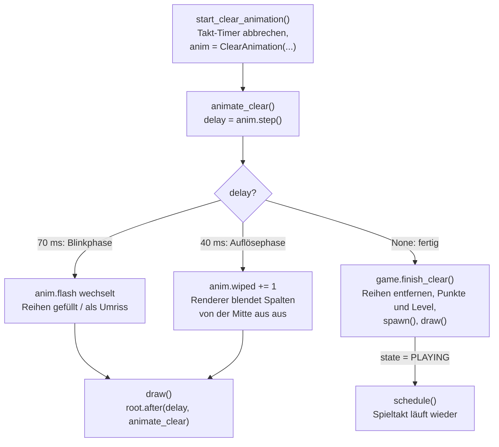
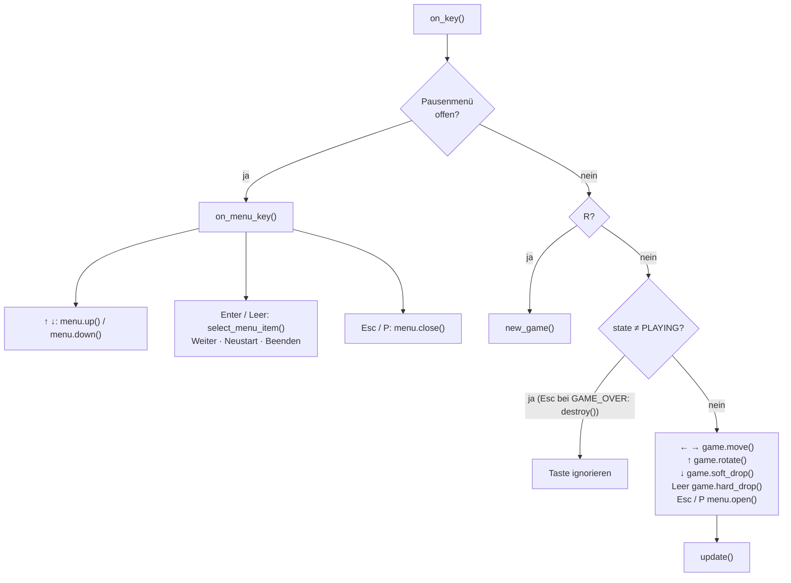

# Tetris – Diagramme

Dokumentation zu den Modulen in `Quickstart mit Claude/`.
Die Diagramme sind in [Mermaid](https://mermaid.js.org/) geschrieben und werden
z. B. auf GitHub und in VS Code direkt als Grafik angezeigt.

## Klassendiagramm

Die Klassen verteilen sich auf vier Module:

| Modul | Klassen | Kennt tkinter? |
|---|---|---|
| `model.py` | `Piece`, `Board`, `Bag`, `GameState`, `Game` | nein |
| `menu.py` | `PauseMenu` | nein |
| `view.py` | `ClearAnimation`, `Renderer` | ja (nur `Renderer`) |
| `Quickstart_mit_Claude.py` | `TetrisApp`, `main()` | ja |

- **`Piece` ist unveränderlich.** `moved()` und `rotated()` liefern neue Steine.
  `Game` probiert einen Kandidaten aus und übernimmt ihn nur, wenn
  `Board.collides()` nichts dagegen hat.
- **`Game` prüft seinen Zustand selbst.** Bewegungen wirken nur in `PLAYING`.
  Deshalb muss die `TetrisApp` nicht überall Flags abfragen.
- **Der `Renderer` liest nur.** Er bekommt `Game`, `PauseMenu` und
  `ClearAnimation` übergeben und verändert nichts daran.
- `job` und `anim_job` in der `TetrisApp` enthalten die IDs der mit
  `root.after()` geplanten Timer oder `None`, wenn gerade keiner geplant ist.

## Spielzustände

Die Pause ist kein Spielzustand: Sie gehört zur Oberfläche und steckt in
`PauseMenu.is_open`. Das `Game` merkt davon nichts, die `TetrisApp` ruft
während der Pause einfach `game.step()` nicht auf.

## Grober Ablauf

Nach dem Start übernimmt die Tk-Ereignisschleife. Sie ruft drei Callbacks der
`TetrisApp` auf, die sich über Timer (`root.after`) wieder anmelden.

### Detail: Spieltakt `tick()`

### Detail: Lösch-Animation `animate_clear()`

### Detail: Tastatur `on_key()`

### Erläuterung

- **Keine eigene Schleife:** Die Endlosschleife ist `root.mainloop()`. Tk ruft
  von dort aus die Callbacks `tick()`, `on_key()` und `animate_clear()` auf.
- **Spieltakt:** `schedule()` meldet mit `root.after()` den nächsten `tick()`
  an, `tick()` ruft am Ende wieder `schedule()` auf. Die Wartezeit kommt aus
  `game.tick_delay` und sinkt mit dem Level von 500 ms auf minimal 80 ms.
- **Pause:** `tick()` läuft weiter, ruft aber `game.step()` nicht auf.
- **Lösch-Animation:** `Game` bleibt im Zustand `CLEARING`, bis die
  `TetrisApp` nach der Animation `finish_clear()` aufruft. Bis dahin ist der
  Spieltakt angehalten. Die Animation verändert das Spielfeld nicht, der
  `Renderer` blendet die Zellen nur aus.
- **Leertaste:** `game.hard_drop()` lässt den Stein ganz nach unten fallen und
  ruft dann `lock()` auf, mit denselben Folgen wie im Spieltakt. Einen neuen
  Takt plant es nicht ein, der bestehende Timer läuft einfach weiter.
- **Programmende:** `root.destroy()` (Menüpunkt „Beenden“ oder Esc bei Game
  Over) schließt das Fenster, dadurch kehrt `mainloop()` zurück.
