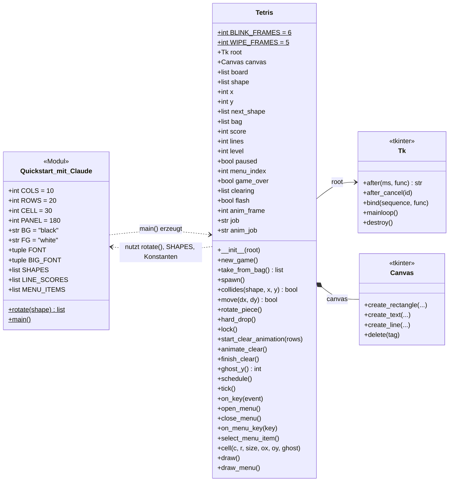
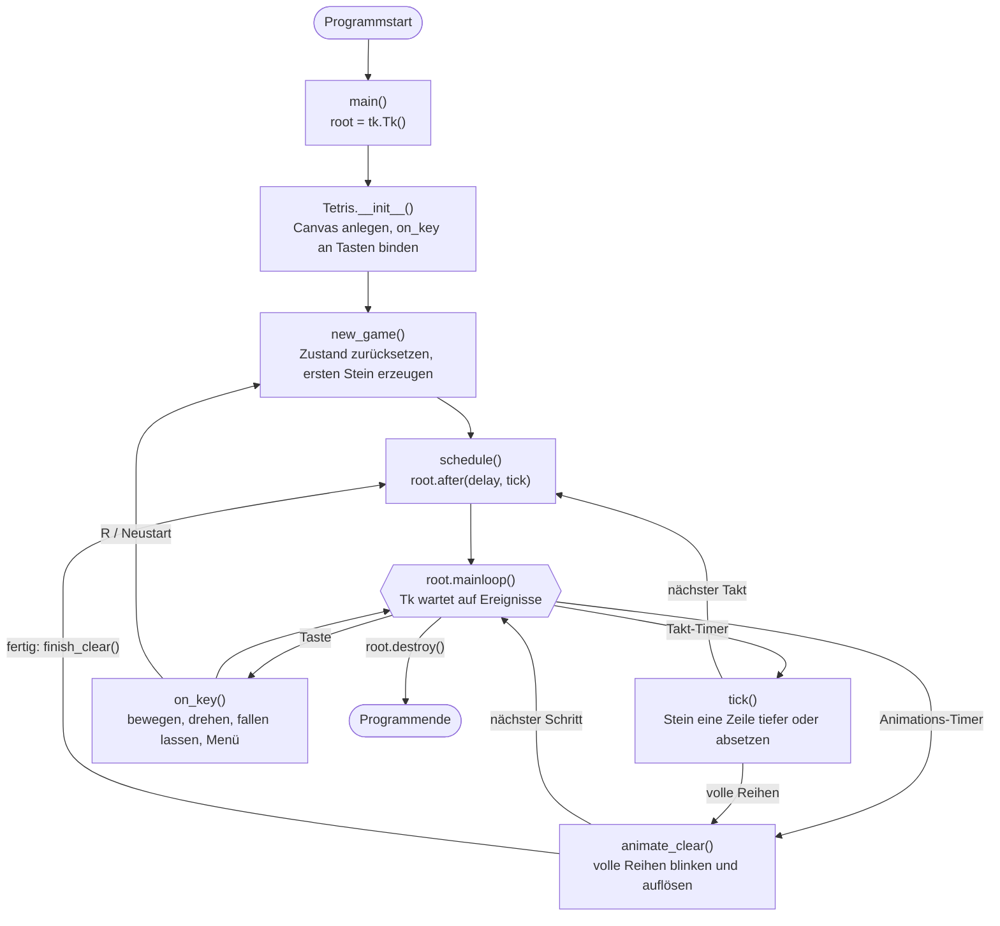
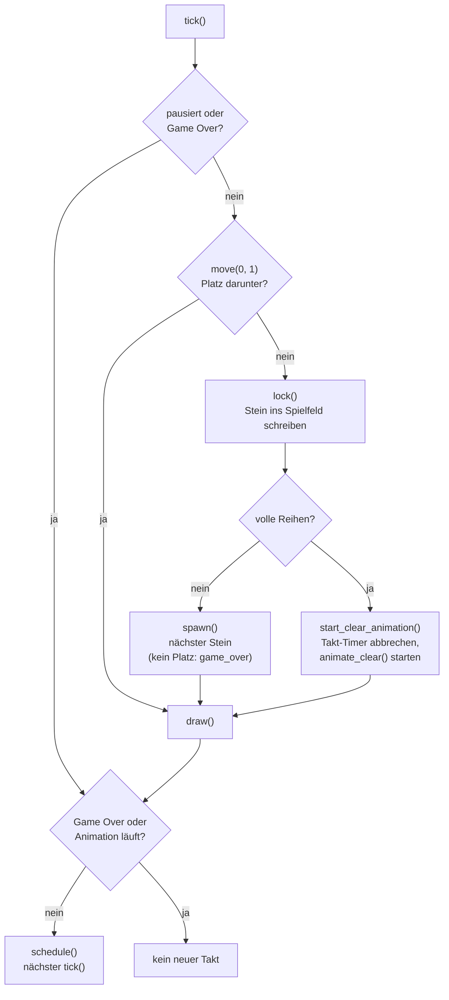
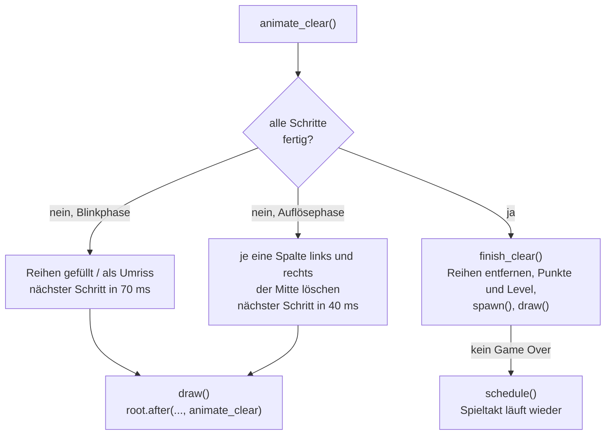
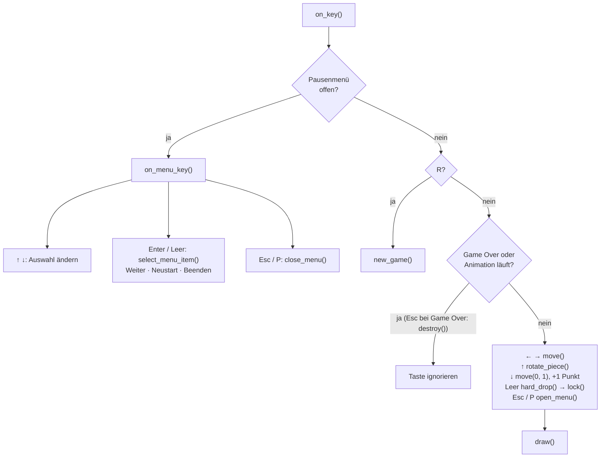

# Tetris – Diagramme

Dokumentation zu `Quickstart mit Claude/Quickstart_mit_Claude.py`.
Die Diagramme sind in [Mermaid](https://mermaid.js.org/) geschrieben und werden
z. B. auf GitHub und in VS Code direkt als Grafik angezeigt.

## Klassendiagramm

Das ganze Spiel steckt in einer Klasse. Ihre Methoden lassen sich in Gruppen
einteilen (wie die Abschnitte im Quelltext):

| Gruppe | Methoden |
|---|---|
| Spiellogik | `new_game`, `take_from_bag`, `spawn`, `collides`, `move`, `rotate_piece`, `hard_drop`, `lock` |
| Lösch-Animation | `start_clear_animation`, `animate_clear`, `finish_clear`, `ghost_y` |
| Zeitsteuerung und Eingabe | `schedule`, `tick`, `on_key` |
| Pausenmenü | `open_menu`, `close_menu`, `on_menu_key`, `select_menu_item` |
| Zeichnen | `cell`, `draw`, `draw_menu` |

`job` und `anim_job` enthalten die IDs der mit `root.after()` geplanten Timer
oder `None`, wenn gerade keiner geplant ist.

## Grober Ablauf

Übersicht: Nach dem Start übernimmt die Tk-Ereignisschleife. Sie ruft drei
Callbacks auf, die sich über Timer (`root.after`) gegenseitig wieder anmelden.

### Detail: Spieltakt `tick()`

### Detail: Lösch-Animation `animate_clear()`

### Detail: Tastatur `on_key()`

### Erläuterung

- **Keine eigene Schleife:** Die Endlosschleife ist `root.mainloop()`. Tk ruft
  von dort aus die Callbacks `tick()`, `on_key()` und `animate_clear()` auf.
- **Spieltakt:** `schedule()` meldet mit `root.after()` den nächsten `tick()`
  an, `tick()` ruft am Ende wieder `schedule()` auf. Die Wartezeit sinkt mit dem
  Level von 500 ms auf minimal 80 ms.
- **Pause:** `tick()` läuft weiter, bewegt aber den Stein nicht.
- **Lösch-Animation:** Solange sie läuft, ist der Spieltakt angehalten.
  `animate_clear()` plant sich selbst neu ein, bis `finish_clear()` den Takt
  wieder startet.
- **Leertaste:** `hard_drop()` lässt den Stein ganz nach unten fallen und ruft
  dann ebenfalls `lock()` auf, mit denselben Folgen wie im Spieltakt
  (nächster Stein oder Lösch-Animation). Einen neuen Takt plant es nicht ein,
  der bestehende Timer läuft einfach weiter.
- **Programmende:** `root.destroy()` (Menüpunkt „Beenden“ oder Esc bei Game
  Over) schließt das Fenster, dadurch kehrt `mainloop()` zurück.
