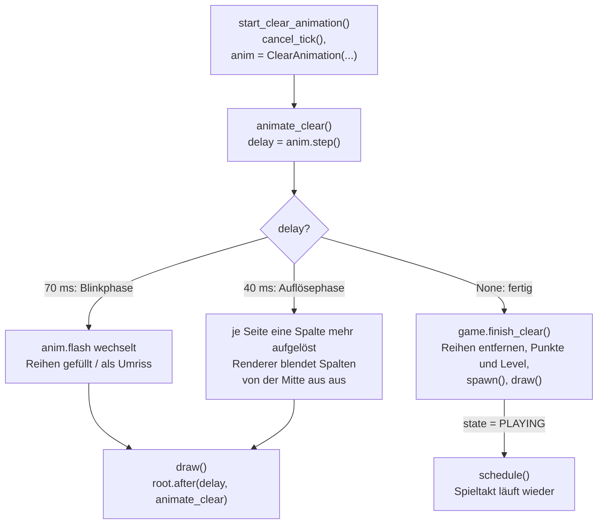

<!-- Automatisch erzeugt aus doc_templates/api/animation.md mit tools/gen_docs.py. Nicht von Hand bearbeiten. -->

# animation – Lösch-Animation

[← Startseite der Dokumentation](../index.md)

So spielt die [`TetrisApp`](app.md#quickstart_mit_claude-tetrisapp) die Animation
mit Hilfe von [`ClearAnimation`](#animation-clearanimation) ab:



<a id="animation"></a>

## Modul `animation`

Fortschritt der Animation beim Löschen voller Reihen.

Dieses Modul kennt kein tkinter. Es zählt nur die Schritte der Animation
mit; gezeichnet wird sie vom [`Renderer`](view.md#view-renderer), die Timer plant
die [`TetrisApp`](app.md#quickstart_mit_claude-tetrisapp).

[Quelltext: `animation.py`](https://github.com/Krysek/Quickstart-mit-Claude/blob/main/Quickstart%20mit%20Claude/animation.py)

### Übersicht

| Name | Art | Beschreibung |
|---|---|---|
| [`ClearAnimation`](#animation-clearanimation) | Klasse | Fortschritt der Animation beim Löschen voller Reihen. |

<a id="animation-clearanimation"></a>

### Klasse `ClearAnimation`

```python
class ClearAnimation(rows: list[int], cols: int)
```

Fortschritt der Animation beim Löschen voller Reihen.

Die Animation hat zwei Phasen:

1. Blinken (`BLINK_FRAMES` Schritte à `BLINK_DELAY` ms): Die Reihen
   wechseln zwischen gefüllt und nur Umriss.
2. Auflösen (ein Schritt pro Spaltenpaar à `WIPE_DELAY` ms): Pro
   Schritt verschwindet links und rechts der Mitte je eine Spalte. Bei
   ungerader Spaltenzahl verschwindet zuerst die mittlere Spalte.

**Attribute:**

| Name | Typ | Beschreibung |
|---|---|---|
| `BLINK_FRAMES` | <code>int</code> | Anzahl der Schritte in der Blinkphase (3x blinken). |
| `BLINK_DELAY` | <code>int</code> | Dauer eines Blinkschritts in ms. |
| `WIPE_DELAY` | <code>int</code> | Dauer eines Auflöseschritts in ms. |
| `rows` | <code>list[int]</code> | Zeilennummern der vollen Reihen. |
| `cols` | <code>int</code> | Breite des Spielfelds. |

Bereitet die Animation vor; den ersten Schritt macht `step()`.

**Parameter:**

| Name | Typ | Standard | Beschreibung |
|---|---|---|---|
| `rows` | <code>list[int]</code> | erforderlich | Zeilennummern der vollen Reihen. |
| `cols` | <code>int</code> | erforderlich | Breite des Spielfelds in Zellen. |

[Quelltext: `animation.py`](https://github.com/Krysek/Quickstart-mit-Claude/blob/main/Quickstart%20mit%20Claude/animation.py#L11-L80)

<a id="animation-clearanimation-flash"></a>

#### `flash` (Eigenschaft)

```python
flash: bool
```

True, wenn die Reihen gerade als Umriss gezeichnet werden.

[Quelltext: `animation.py`](https://github.com/Krysek/Quickstart-mit-Claude/blob/main/Quickstart%20mit%20Claude/animation.py#L48-L50)

<a id="animation-clearanimation-step"></a>

#### `step()`

```python
def step() -> int | None
```

Geht einen Schritt weiter.

**Rückgabe:**

| Typ | Beschreibung |
|---|---|
| <code>int &#124; None</code> | Die Wartezeit bis zum nächsten Schritt in ms, oder None, wenn die |
| <code>int &#124; None</code> | Animation vorbei ist. |

[Quelltext: `animation.py`](https://github.com/Krysek/Quickstart-mit-Claude/blob/main/Quickstart%20mit%20Claude/animation.py#L52-L70)

<a id="animation-clearanimation-hides"></a>

#### `hides()`

```python
def hides(col: int) -> bool
```

Gibt True zurück, wenn die Spalte schon aufgelöst ist.

**Parameter:**

| Name | Typ | Standard | Beschreibung |
|---|---|---|---|
| `col` | <code>int</code> | erforderlich | Spalte im Spielfeld. |

[Quelltext: `animation.py`](https://github.com/Krysek/Quickstart-mit-Claude/blob/main/Quickstart%20mit%20Claude/animation.py#L72-L80)
