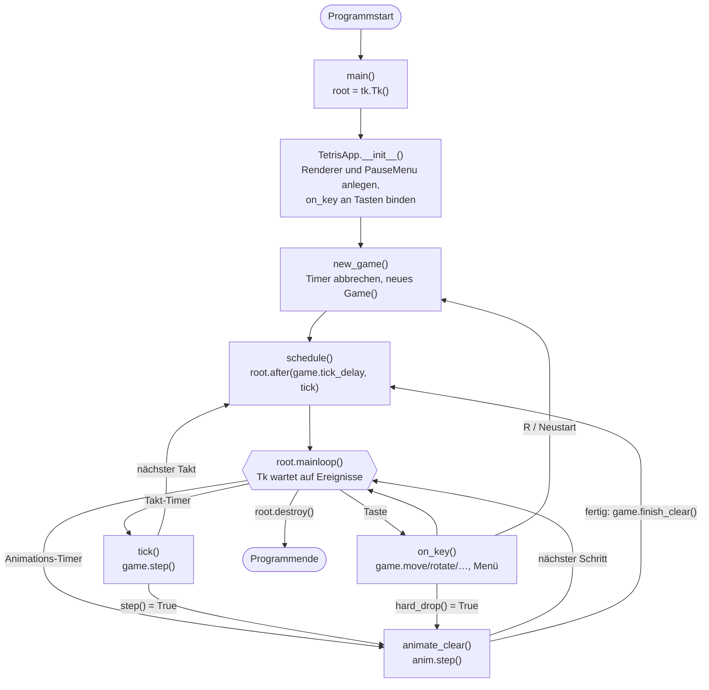
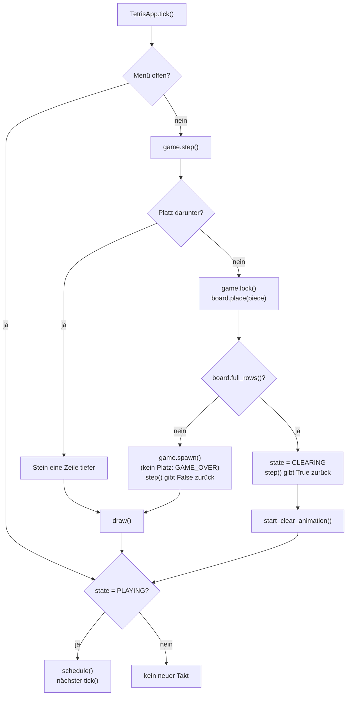
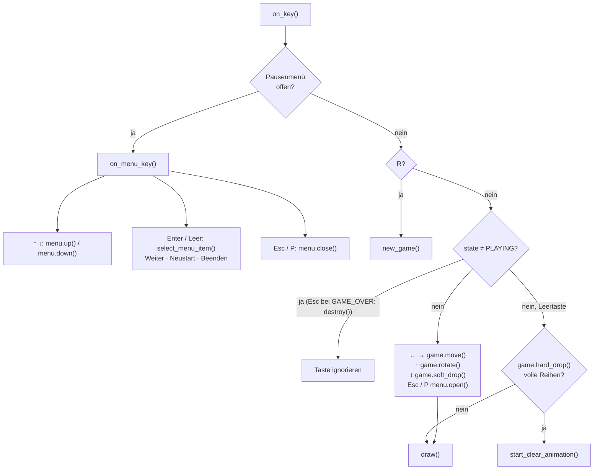

<!-- Automatisch erzeugt aus doc_templates/api/app.md mit tools/gen_docs.py. Nicht von Hand bearbeiten. -->

# TetrisApp – Steuerung

[← Startseite der Dokumentation](../index.md)

Die `TetrisApp` hat keine eigene Spielschleife. Die Ereignisschleife von
tkinter ruft ihre Callbacks auf:



## Spieltakt



## Tastatur



<a id="quickstart_mit_claude"></a>

## Modul `Quickstart_mit_Claude`

Einfaches Tetris in Schwarz/Weiß mit tkinter.

Das Spiel läuft in einem eigenen Fenster. Links liegt das Spielfeld
(10 x 20 Zellen), rechts eine Seitenleiste mit Vorschau auf den nächsten
Stein, Punktestand, gelöschten Reihen, Level und Tastenbelegung.

> **Aufbau**
>
> - `model.py`: Spielregeln (`Piece`, `Board`, `Bag`, `Game`), ohne tkinter
> - `menu.py`: Zustand des Pausenmenüs (`PauseMenu`), ohne tkinter
> - `animation.py`: Lösch-Animation (`ClearAnimation`), ohne tkinter
> - `view.py`: Zeichnen auf dem Canvas (`Renderer`)
> - `Quickstart_mit_Claude.py`: verbindet alles, Tastatur und Timer (`TetrisApp`)

> **Steuerung**
>
> - Pfeil links/rechts: Stein bewegen
> - Pfeil hoch: Stein drehen
> - Pfeil runter: Stein schneller fallen lassen (+1 Punkt pro Zeile)
> - Leertaste: Stein sofort fallen lassen (+2 Punkte pro Zeile)
> - Esc oder P: Pausenmenü öffnen/schließen
> - Esc bei Game Over: Beenden
> - R: Neues Spiel

> **Im Pausenmenü**
>
> - Pfeil hoch/runter: Eintrag wählen (Weiter, Neustart, Beenden)
> - Enter oder Leertaste: Eintrag ausführen

> **Start**
>
> `python Quickstart_mit_Claude.py`

[Quelltext: `Quickstart_mit_Claude.py`](https://github.com/Krysek/Quickstart-mit-Claude/blob/main/Quickstart%20mit%20Claude/Quickstart_mit_Claude.py)

### Übersicht

| Name | Art | Beschreibung |
|---|---|---|
| [`TetrisApp`](#quickstart_mit_claude-tetrisapp) | Klasse | Verbindet Spiel, Menü und Darstellung mit tkinter. |
| [`main`](#quickstart_mit_claude-main) | Funktion | Öffnet das Spielfenster und startet die tkinter-Ereignisschleife. |

<a id="quickstart_mit_claude-tetrisapp"></a>

### Klasse `TetrisApp`

```python
class TetrisApp(root: tk.Tk, cols: int = COLS, rows: int = ROWS)
```

Verbindet Spiel, Menü und Darstellung mit tkinter.

Es gibt keine eigene Spielschleife: `root.mainloop()` ruft `on_key()`
bei Tastendrücken auf, und über `root.after` laufen zwei Timer: `tick()`
für den Spieltakt und `animate_clear()` für die Lösch-Animation.
Während der Animation ist der Spieltakt angehalten.

**Attribute:**

| Name | Typ | Beschreibung |
|---|---|---|
| `root` | <code>tk.Tk</code> | Das tkinter-Hauptfenster. |
| `cols` | <code>int</code> | Breite des Spielfelds in Zellen, für Spiel und Darstellung. |
| `rows` | <code>int</code> | Höhe des Spielfelds in Zellen, für Spiel und Darstellung. |
| `renderer` | <code>Renderer</code> | Zeichnet den Zustand auf den Canvas. |
| `menu` | <code>PauseMenu</code> | Das Pausenmenü. |
| `game` | <code>Game</code> | Das laufende Spiel. |
| `anim` | <code>ClearAnimation &#124; None</code> | Die laufende Lösch-Animation oder None. |
| `job` | <code>str &#124; None</code> | ID des geplanten nächsten Spieltakts (oder None). |
| `anim_job` | <code>str &#124; None</code> | ID des geplanten nächsten Animationsschritts (oder None). |

Baut das Fenster auf und startet das erste Spiel.

**Parameter:**

| Name | Typ | Standard | Beschreibung |
|---|---|---|---|
| `root` | <code>tk.Tk</code> | erforderlich | Das tkinter-Hauptfenster, in dem das Spiel läuft. |
| `cols` | <code>int</code> | <code>COLS</code> | Breite des Spielfelds in Zellen. |
| `rows` | <code>int</code> | <code>ROWS</code> | Höhe des Spielfelds in Zellen. |

[Quelltext: `Quickstart_mit_Claude.py`](https://github.com/Krysek/Quickstart-mit-Claude/blob/main/Quickstart%20mit%20Claude/Quickstart_mit_Claude.py#L39-L242)

<a id="quickstart_mit_claude-tetrisapp-new_game"></a>

#### `new_game()`

```python
def new_game() -> None
```

Startet ein neues Spiel.

Bricht dabei einen laufenden Spieltakt und eine laufende
Lösch-Animation ab, damit nach einem Neustart keine alten
Zeitgeber weiterlaufen.

[Quelltext: `Quickstart_mit_Claude.py`](https://github.com/Krysek/Quickstart-mit-Claude/blob/main/Quickstart%20mit%20Claude/Quickstart_mit_Claude.py#L81-L93)

<a id="quickstart_mit_claude-tetrisapp-cancel_tick"></a>

#### `cancel_tick()`

```python
def cancel_tick() -> None
```

Bricht den geplanten Spieltakt ab, falls es einen gibt.

[Quelltext: `Quickstart_mit_Claude.py`](https://github.com/Krysek/Quickstart-mit-Claude/blob/main/Quickstart%20mit%20Claude/Quickstart_mit_Claude.py#L95-L99)

<a id="quickstart_mit_claude-tetrisapp-cancel_timers"></a>

#### `cancel_timers()`

```python
def cancel_timers() -> None
```

Bricht Spieltakt und Animationsschritt ab, falls geplant.

[Quelltext: `Quickstart_mit_Claude.py`](https://github.com/Krysek/Quickstart-mit-Claude/blob/main/Quickstart%20mit%20Claude/Quickstart_mit_Claude.py#L101-L106)

<a id="quickstart_mit_claude-tetrisapp-draw"></a>

#### `draw()`

```python
def draw() -> None
```

Zeichnet den aktuellen Zustand neu.

[Quelltext: `Quickstart_mit_Claude.py`](https://github.com/Krysek/Quickstart-mit-Claude/blob/main/Quickstart%20mit%20Claude/Quickstart_mit_Claude.py#L108-L110)

<a id="quickstart_mit_claude-tetrisapp-schedule"></a>

#### `schedule()`

```python
def schedule() -> None
```

Plant den nächsten Spieltakt ein (Wartezeit je nach Level).

[Quelltext: `Quickstart_mit_Claude.py`](https://github.com/Krysek/Quickstart-mit-Claude/blob/main/Quickstart%20mit%20Claude/Quickstart_mit_Claude.py#L114-L116)

<a id="quickstart_mit_claude-tetrisapp-tick"></a>

#### `tick()`

```python
def tick() -> None
```

Ein Spieltakt: Der Stein fällt eine Zeile oder wird abgesetzt.

Während einer Pause passiert nichts, der Takt läuft aber weiter.
Bei Game Over oder während der Lösch-Animation wird kein neuer Takt
geplant.

[Quelltext: `Quickstart_mit_Claude.py`](https://github.com/Krysek/Quickstart-mit-Claude/blob/main/Quickstart%20mit%20Claude/Quickstart_mit_Claude.py#L118-L132)

<a id="quickstart_mit_claude-tetrisapp-start_clear_animation"></a>

#### `start_clear_animation()`

```python
def start_clear_animation() -> None
```

Hält den Spieltakt an und startet die Animation für volle Reihen.

Wird aufgerufen, wenn [`Game.step`](model.md#model-game-step) oder
[`Game.hard_drop`](model.md#model-game-hard_drop) meldet, dass Reihen voll sind.

[Quelltext: `Quickstart_mit_Claude.py`](https://github.com/Krysek/Quickstart-mit-Claude/blob/main/Quickstart%20mit%20Claude/Quickstart_mit_Claude.py#L136-L144)

<a id="quickstart_mit_claude-tetrisapp-animate_clear"></a>

#### `animate_clear()`

```python
def animate_clear() -> None
```

Zeigt einen Schritt der Lösch-Animation und plant den nächsten.

Ist die Animation vorbei, werden die Reihen entfernt und der
Spieltakt läuft wieder an.

[Quelltext: `Quickstart_mit_Claude.py`](https://github.com/Krysek/Quickstart-mit-Claude/blob/main/Quickstart%20mit%20Claude/Quickstart_mit_Claude.py#L146-L163)

<a id="quickstart_mit_claude-tetrisapp-on_key"></a>

#### `on_key()`

```python
def on_key(event: tk.Event) -> None
```

Reagiert auf Tastendrücke (Belegung siehe Modul-Docstring).

Ist das Pausenmenü offen, gehen alle Tasten an `on_menu_key()`.
R funktioniert immer. Esc und P öffnen im laufenden Spiel das
Pausenmenü, bei Game Over beendet Esc das Programm. Während der
Lösch-Animation sind alle Tasten außer R gesperrt.

**Parameter:**

| Name | Typ | Standard | Beschreibung |
|---|---|---|---|
| `event` | <code>tk.Event</code> | erforderlich | Das tkinter-Tastaturereignis. |

[Quelltext: `Quickstart_mit_Claude.py`](https://github.com/Krysek/Quickstart-mit-Claude/blob/main/Quickstart%20mit%20Claude/Quickstart_mit_Claude.py#L167-L205)

<a id="quickstart_mit_claude-tetrisapp-on_menu_key"></a>

#### `on_menu_key()`

```python
def on_menu_key(key: str) -> None
```

Verarbeitet Tastendrücke, solange das Pausenmenü offen ist.

Pfeil hoch/runter wechseln den Eintrag (am Ende geht es oben weiter),
Enter oder Leertaste führen ihn aus. Esc und P schließen das Menü,
R startet direkt neu.

**Parameter:**

| Name | Typ | Standard | Beschreibung |
|---|---|---|---|
| `key` | <code>str</code> | erforderlich | Name der gedrückten Taste in Kleinbuchstaben (tkinter-keysym). |

[Quelltext: `Quickstart_mit_Claude.py`](https://github.com/Krysek/Quickstart-mit-Claude/blob/main/Quickstart%20mit%20Claude/Quickstart_mit_Claude.py#L207-L231)

<a id="quickstart_mit_claude-tetrisapp-select_menu_item"></a>

#### `select_menu_item()`

```python
def select_menu_item() -> None
```

Führt den ausgewählten Menüeintrag aus: Weiter, Neustart oder Beenden.

[Quelltext: `Quickstart_mit_Claude.py`](https://github.com/Krysek/Quickstart-mit-Claude/blob/main/Quickstart%20mit%20Claude/Quickstart_mit_Claude.py#L233-L242)

<a id="quickstart_mit_claude-main"></a>

### `main()`

```python
def main() -> None
```

Öffnet das Spielfenster und startet die tkinter-Ereignisschleife.

[Quelltext: `Quickstart_mit_Claude.py`](https://github.com/Krysek/Quickstart-mit-Claude/blob/main/Quickstart%20mit%20Claude/Quickstart_mit_Claude.py#L245-L249)
