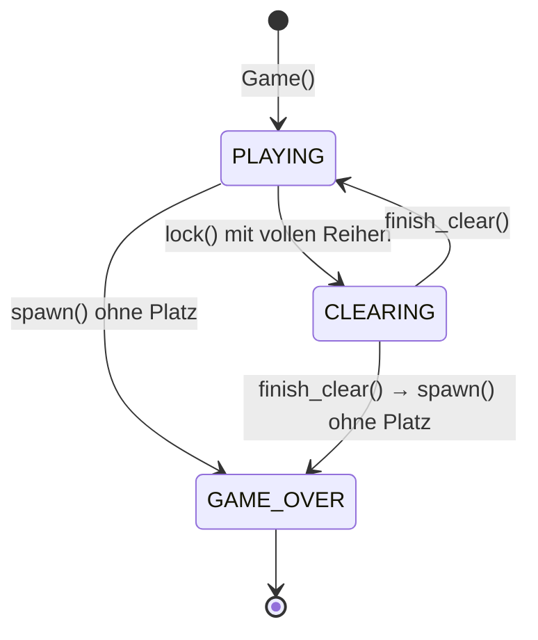

<!-- Automatisch erzeugt aus doc_templates/api/model.md mit tools/gen_docs.py. Nicht von Hand bearbeiten. -->

# model – Spielregeln

[← Startseite der Dokumentation](../index.md)

Die komplette Spiellogik, ohne tkinter. Ein `Game` durchläuft diese Zustände:



<a id="model"></a>

## Modul `model`

Spiellogik von Tetris, unabhängig von der Oberfläche.

Dieses Modul kennt kein tkinter. Es enthält nur die Regeln: Steine, Spielfeld,
7er-Beutel und den Spielablauf mit Punkten und Level. Dadurch lässt es sich
ohne Fenster testen (siehe `test_tetris.py`).

[Quelltext: `model.py`](https://github.com/Krysek/Quickstart-mit-Claude/blob/main/Quickstart%20mit%20Claude/model.py)

### Übersicht

| Name | Art | Beschreibung |
|---|---|---|
| [`Shape`](#model-shape) | Typ-Alias | Form eines Steins als quadratische Matrix: 1 = Block, 0 = leer. |
| [`Piece`](#model-piece) | Klasse | Ein Stein: eine Form an einer Position im Spielfeld. |
| [`Board`](#model-board) | Klasse | Das Spielfeld mit den bereits abgesetzten Blöcken. |
| [`Bag`](#model-bag) | Klasse | Der 7er-Beutel, aus dem die Steine gezogen werden. |
| [`GameState`](#model-gamestate) | Aufzählung | Zustand des Spiels. |
| [`Game`](#model-game) | Klasse | Ein Tetris-Spiel: Spielfeld, fallender Stein, Punkte und Level. |

<a id="model-shape"></a>

### `Shape`

```python
Shape: TypeAlias = tuple[tuple[int, ...], ...]
```

Form eines Steins als quadratische Matrix: 1 = Block, 0 = leer.

[Quelltext: `model.py`](https://github.com/Krysek/Quickstart-mit-Claude/blob/main/Quickstart%20mit%20Claude/model.py#L14-L14)

<a id="model-piece"></a>

### Klasse `Piece`

```python
@dataclass(frozen=True)
class Piece(shape: Shape, x: int = 0, y: int = 0)
```

Ein Stein: eine Form an einer Position im Spielfeld.

Ein `Piece` ist unveränderlich. [`moved`](#model-piece-moved) und
[`rotated`](#model-piece-rotated) liefern neue Steine, sodass man eine
Bewegung erst ausprobieren und dann übernehmen kann.

**Attribute:**

| Name | Typ | Beschreibung |
|---|---|---|
| `shape` | <code>Shape</code> | Form des Steins (siehe [`Shape`](#model-shape)). |
| `x` | <code>int</code> | Spalte der linken oberen Ecke von `shape`. |
| `y` | <code>int</code> | Zeile der linken oberen Ecke von `shape`. |

[Quelltext: `model.py`](https://github.com/Krysek/Quickstart-mit-Claude/blob/main/Quickstart%20mit%20Claude/model.py#L38-L78)

<a id="model-piece-cells"></a>

#### `cells()`

```python
def cells() -> Iterator[tuple[int, int]]
```

Liefert die belegten Zellen des Steins im Spielfeld.

**Liefert:**

| Typ | Beschreibung |
|---|---|
| <code>tuple[int, int]</code> | Paare `(spalte, zeile)` für jeden Block des Steins. |

[Quelltext: `model.py`](https://github.com/Krysek/Quickstart-mit-Claude/blob/main/Quickstart%20mit%20Claude/model.py#L56-L65)

<a id="model-piece-moved"></a>

#### `moved()`

```python
def moved(dx: int, dy: int) -> Piece
```

Gibt einen um `dx` Spalten und `dy` Zeilen verschobenen Stein zurück.

**Parameter:**

| Name | Typ | Standard | Beschreibung |
|---|---|---|---|
| `dx` | <code>int</code> | erforderlich | Verschiebung in Spalten (negativ = nach links). |
| `dy` | <code>int</code> | erforderlich | Verschiebung in Zeilen (positiv = nach unten). |

[Quelltext: `model.py`](https://github.com/Krysek/Quickstart-mit-Claude/blob/main/Quickstart%20mit%20Claude/model.py#L67-L74)

<a id="model-piece-rotated"></a>

#### `rotated()`

```python
def rotated() -> Piece
```

Gibt den um 90° im Uhrzeigersinn gedrehten Stein zurück.

[Quelltext: `model.py`](https://github.com/Krysek/Quickstart-mit-Claude/blob/main/Quickstart%20mit%20Claude/model.py#L76-L78)

<a id="model-board"></a>

### Klasse `Board`

```python
class Board(cols: int = COLS, rows: int = ROWS)
```

Das Spielfeld mit den bereits abgesetzten Blöcken.

**Attribute:**

| Name | Typ | Beschreibung |
|---|---|---|
| `cols` | <code>int</code> | Breite in Zellen. |
| `rows` | <code>int</code> | Höhe in Zellen. |
| `grid` | <code>list[list[int]]</code> | `grid[zeile][spalte]`, 1 = belegt, 0 = frei. |

Erzeugt ein leeres Spielfeld.

**Parameter:**

| Name | Typ | Standard | Beschreibung |
|---|---|---|---|
| `cols` | <code>int</code> | <code>COLS</code> | Breite in Zellen. |
| `rows` | <code>int</code> | <code>ROWS</code> | Höhe in Zellen. |

[Quelltext: `model.py`](https://github.com/Krysek/Quickstart-mit-Claude/blob/main/Quickstart%20mit%20Claude/model.py#L81-L142)

<a id="model-board-collides"></a>

#### `collides()`

```python
def collides(piece: Piece) -> bool
```

Prüft, ob ein Stein an seiner Position keinen Platz hätte.

**Parameter:**

| Name | Typ | Standard | Beschreibung |
|---|---|---|---|
| `piece` | <code>Piece</code> | erforderlich | Der zu prüfende Stein. |

**Rückgabe:**

| Typ | Beschreibung |
|---|---|
| <code>bool</code> | True, wenn ein Block links, rechts oder unten aus dem Spielfeld ragt oder ein belegtes Feld überdeckt, sonst False. Oben darf der Stein über das Spielfeld hinausragen. |

[Quelltext: `model.py`](https://github.com/Krysek/Quickstart-mit-Claude/blob/main/Quickstart%20mit%20Claude/model.py#L101-L117)

<a id="model-board-place"></a>

#### `place()`

```python
def place(piece: Piece) -> None
```

Trägt einen Stein fest ins Spielfeld ein (Teile oberhalb entfallen).

**Parameter:**

| Name | Typ | Standard | Beschreibung |
|---|---|---|---|
| `piece` | <code>Piece</code> | erforderlich | Der abzusetzende Stein. |

[Quelltext: `model.py`](https://github.com/Krysek/Quickstart-mit-Claude/blob/main/Quickstart%20mit%20Claude/model.py#L119-L127)

<a id="model-board-full_rows"></a>

#### `full_rows()`

```python
def full_rows() -> list[int]
```

Gibt die Zeilennummern aller vollständig belegten Reihen zurück.

[Quelltext: `model.py`](https://github.com/Krysek/Quickstart-mit-Claude/blob/main/Quickstart%20mit%20Claude/model.py#L129-L131)

<a id="model-board-remove_rows"></a>

#### `remove_rows()`

```python
def remove_rows(rows: list[int]) -> None
```

Entfernt die angegebenen Reihen; darüberliegende rutschen nach.

Oben kommen entsprechend viele leere Reihen dazu.

**Parameter:**

| Name | Typ | Standard | Beschreibung |
|---|---|---|---|
| `rows` | <code>list[int]</code> | erforderlich | Zeilennummern der zu entfernenden Reihen. |

[Quelltext: `model.py`](https://github.com/Krysek/Quickstart-mit-Claude/blob/main/Quickstart%20mit%20Claude/model.py#L133-L142)

<a id="model-bag"></a>

### Klasse `Bag`

```python
class Bag(shapes: Sequence[Shape] = SHAPES, rng: random.Random | None = None)
```

Der 7er-Beutel, aus dem die Steine gezogen werden.

Jede Form kommt pro Runde genau einmal vor, in zufälliger Reihenfolge.
So gibt es keine langen Durststrecken ohne einen bestimmten Stein.

**Attribute:**

| Name | Typ | Beschreibung |
|---|---|---|
| `shapes` | <code>Sequence[Shape]</code> | Die Formen, die der Beutel enthält. |
| `rng` | <code>random.Random</code> | Der Zufallsgenerator zum Mischen. |
| `items` | <code>list[Shape]</code> | Die in dieser Runde noch nicht gezogenen Formen. |

Erzeugt einen leeren Beutel; er wird beim ersten Ziehen gefüllt.

**Parameter:**

| Name | Typ | Standard | Beschreibung |
|---|---|---|---|
| `shapes` | <code>Sequence[Shape]</code> | <code>SHAPES</code> | Die Formen, die der Beutel enthält. |
| `rng` | <code>random.Random &#124; None</code> | <code>None</code> | Zufallsgenerator (z. B. `random.Random(42)` für Tests). |

[Quelltext: `model.py`](https://github.com/Krysek/Quickstart-mit-Claude/blob/main/Quickstart%20mit%20Claude/model.py#L145-L174)

<a id="model-bag-take"></a>

#### `take()`

```python
def take() -> Shape
```

Zieht die nächste Form; ein leerer Beutel wird neu gefüllt und gemischt.

[Quelltext: `model.py`](https://github.com/Krysek/Quickstart-mit-Claude/blob/main/Quickstart%20mit%20Claude/model.py#L169-L174)

<a id="model-gamestate"></a>

### Klasse `GameState`

```python
class GameState(Enum)
```

Zustand des Spiels.

**Werte:**

| Name | Bedeutung |
|---|---|
| `PLAYING` | Ein Stein fällt. |
| `CLEARING` | Volle Reihen warten auf [`finish_clear`](#model-game-finish_clear). |
| `GAME_OVER` | Ein neuer Stein hatte keinen Platz mehr. |

[Quelltext: `model.py`](https://github.com/Krysek/Quickstart-mit-Claude/blob/main/Quickstart%20mit%20Claude/model.py#L177-L185)

<a id="model-game"></a>

### Klasse `Game`

```python
class Game(cols: int = COLS, rows: int = ROWS, rng: random.Random | None = None)
```

Ein Tetris-Spiel: Spielfeld, fallender Stein, Punkte und Level.

Alle Aktionen ([`move`](#model-game-move), [`rotate`](#model-game-rotate),
[`soft_drop`](#model-game-soft_drop), [`hard_drop`](#model-game-hard_drop),
[`step`](#model-game-step)) wirken nur im Zustand `PLAYING`.

Setzt ein Stein auf und füllt dabei Reihen, wechselt das Spiel in den
Zustand `CLEARING` und merkt sich die Reihen in `clearing`. Erst
[`finish_clear`](#model-game-finish_clear) entfernt sie. Dazwischen kann
die Oberfläche eine Animation abspielen.

**Attribute:**

| Name | Typ | Beschreibung |
|---|---|---|
| `board` | <code>Board</code> | Das Spielfeld. |
| `bag` | <code>Bag</code> | Der 7er-Beutel. |
| `piece` | <code>Piece</code> | Der aktuell fallende Stein. |
| `next_shape` | <code>Shape</code> | Form des nächsten Steins (für die Vorschau). |
| `score` | <code>int</code> | Punktestand. |
| `lines` | <code>int</code> | Anzahl der bisher gelöschten Reihen. |
| `level` | <code>int</code> | Aktuelles Level (steigt alle 10 Reihen). |
| `state` | <code>GameState</code> | Der aktuelle [`GameState`](#model-gamestate). |
| `clearing` | <code>list[int]</code> | Zeilennummern der vollen Reihen im Zustand `CLEARING`. |

Startet ein neues Spiel mit leerem Spielfeld und erstem Stein.

**Parameter:**

| Name | Typ | Standard | Beschreibung |
|---|---|---|---|
| `cols` | <code>int</code> | <code>COLS</code> | Breite des Spielfelds in Zellen. |
| `rows` | <code>int</code> | <code>ROWS</code> | Höhe des Spielfelds in Zellen. |
| `rng` | <code>random.Random &#124; None</code> | <code>None</code> | Zufallsgenerator für den 7er-Beutel (z. B. für Tests). |

[Quelltext: `model.py`](https://github.com/Krysek/Quickstart-mit-Claude/blob/main/Quickstart%20mit%20Claude/model.py#L188-L370)

<a id="model-game-tick_delay"></a>

#### `tick_delay` (Eigenschaft)

```python
tick_delay: int
```

Wartezeit zwischen zwei Spieltakten in ms.

Beginnt bei 500 ms und sinkt pro Level um 45 ms, aber nie unter 80 ms.

[Quelltext: `model.py`](https://github.com/Krysek/Quickstart-mit-Claude/blob/main/Quickstart%20mit%20Claude/model.py#L232-L237)

<a id="model-game-spawn"></a>

#### `spawn()`

```python
def spawn() -> None
```

Lässt den nächsten Stein oben in der Mitte erscheinen.

Ist dort kein Platz mehr, wechselt das Spiel zu `GAME_OVER`.

[Quelltext: `model.py`](https://github.com/Krysek/Quickstart-mit-Claude/blob/main/Quickstart%20mit%20Claude/model.py#L245-L252)

<a id="model-game-move"></a>

#### `move()`

```python
def move(dx: int, dy: int) -> bool
```

Verschiebt den fallenden Stein, falls dort Platz ist.

**Parameter:**

| Name | Typ | Standard | Beschreibung |
|---|---|---|---|
| `dx` | <code>int</code> | erforderlich | Verschiebung in Spalten (-1 = links, 1 = rechts). |
| `dy` | <code>int</code> | erforderlich | Verschiebung in Zeilen (1 = nach unten). |

**Rückgabe:**

| Typ | Beschreibung |
|---|---|
| <code>bool</code> | True, wenn der Stein verschoben wurde, sonst False. |

[Quelltext: `model.py`](https://github.com/Krysek/Quickstart-mit-Claude/blob/main/Quickstart%20mit%20Claude/model.py#L261-L271)

<a id="model-game-rotate"></a>

#### `rotate()`

```python
def rotate() -> bool
```

Dreht den fallenden Stein im Uhrzeigersinn, wenn möglich.

Passt der gedrehte Stein nicht an seine Stelle (z. B. direkt an der
Wand), wird er testweise bis zu zwei Spalten nach links oder rechts
versetzt ("Wall Kick"). Klappt keine Variante, bleibt er unverändert.

**Rückgabe:**

| Typ | Beschreibung |
|---|---|
| <code>bool</code> | True, wenn der Stein gedreht wurde, sonst False. |

[Quelltext: `model.py`](https://github.com/Krysek/Quickstart-mit-Claude/blob/main/Quickstart%20mit%20Claude/model.py#L273-L287)

<a id="model-game-soft_drop"></a>

#### `soft_drop()`

```python
def soft_drop() -> bool
```

Lässt den Stein eine Zeile fallen und gibt dafür 1 Punkt.

**Rückgabe:**

| Typ | Beschreibung |
|---|---|
| <code>bool</code> | True, wenn der Stein gefallen ist, sonst False. |

[Quelltext: `model.py`](https://github.com/Krysek/Quickstart-mit-Claude/blob/main/Quickstart%20mit%20Claude/model.py#L289-L298)

<a id="model-game-hard_drop"></a>

#### `hard_drop()`

```python
def hard_drop() -> bool
```

Lässt den Stein sofort ganz nach unten fallen und setzt ihn ab.

Gibt 2 Punkte pro übersprungener Zeile.

**Rückgabe:**

| Typ | Beschreibung |
|---|---|
| <code>bool</code> | True, wenn dadurch Reihen voll sind (siehe [`lock`](#model-game-lock)). |

[Quelltext: `model.py`](https://github.com/Krysek/Quickstart-mit-Claude/blob/main/Quickstart%20mit%20Claude/model.py#L300-L313)

<a id="model-game-step"></a>

#### `step()`

```python
def step() -> bool
```

Ein Spieltakt: Der Stein fällt eine Zeile oder wird abgesetzt.

**Rückgabe:**

| Typ | Beschreibung |
|---|---|
| <code>bool</code> | True, wenn der Stein abgesetzt wurde und dadurch Reihen voll sind (siehe [`lock`](#model-game-lock)). |

[Quelltext: `model.py`](https://github.com/Krysek/Quickstart-mit-Claude/blob/main/Quickstart%20mit%20Claude/model.py#L315-L324)

<a id="model-game-lock"></a>

#### `lock()`

```python
def lock() -> bool
```

Setzt den fallenden Stein fest ins Spielfeld.

Sind dadurch Reihen voll, wechselt das Spiel zu `CLEARING`.
Andernfalls erscheint direkt der nächste Stein.

**Rückgabe:**

| Typ | Beschreibung |
|---|---|
| <code>bool</code> | True, wenn Reihen voll sind und auf [`finish_clear`](#model-game-finish_clear) warten. |

[Quelltext: `model.py`](https://github.com/Krysek/Quickstart-mit-Claude/blob/main/Quickstart%20mit%20Claude/model.py#L326-L343)

<a id="model-game-finish_clear"></a>

#### `finish_clear()`

```python
def finish_clear() -> None
```

Entfernt die vollen Reihen und setzt das Spiel fort.

Aktualisiert Punkte, Reihenzahl und Level und lässt den nächsten
Stein erscheinen.

[Quelltext: `model.py`](https://github.com/Krysek/Quickstart-mit-Claude/blob/main/Quickstart%20mit%20Claude/model.py#L345-L360)

<a id="model-game-ghost"></a>

#### `ghost()`

```python
def ghost() -> Piece
```

Gibt den Stein an der Position zurück, an der er landen würde.

Wird für den Umriss ("Ghost") genutzt, der die Landeposition anzeigt.

[Quelltext: `model.py`](https://github.com/Krysek/Quickstart-mit-Claude/blob/main/Quickstart%20mit%20Claude/model.py#L362-L370)
