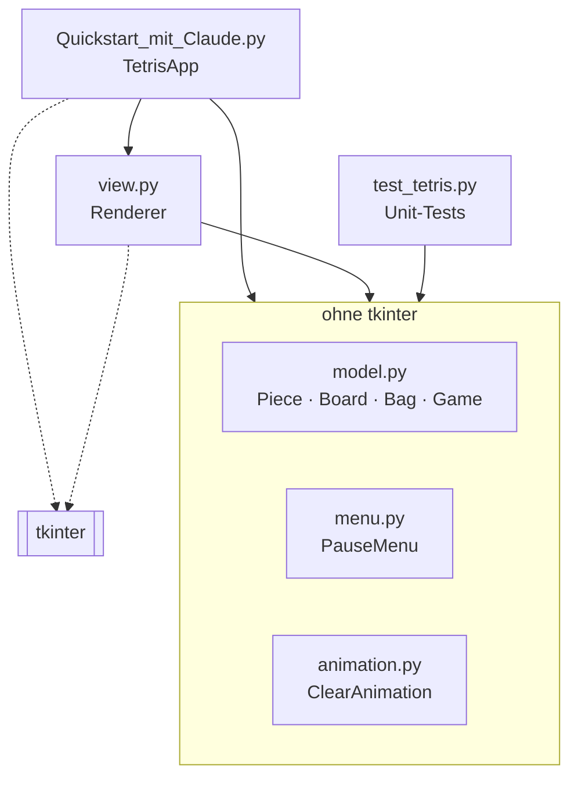

<!-- Automatisch erzeugt aus doc_templates/index.md mit tools/gen_docs.py. Nicht von Hand bearbeiten. -->

# Tetris in Schwarz/Weiß

Ein schlichtes, vollständig spielbares **Tetris** in Python, ohne externe
Abhängigkeiten. Gezeichnet wird mit `tkinter`, das bei Python schon dabei ist.

```bash
python "Quickstart mit Claude/Quickstart_mit_Claude.py"
```

## Aufbau

Das Spiel ist in Logik und Oberfläche aufgeteilt:



Ein Pfeil bedeutet „importiert“; ein Pfeil auf den Kasten heißt, dass alle
drei Module darin importiert werden. Nur `view.py` und
`Quickstart_mit_Claude.py` hängen von tkinter ab (gestrichelt). Alles im Kasten
„ohne tkinter“ lässt sich ohne Fenster testen.

| Klasse | Modul | Aufgabe |
|---|---|---|
| [`Piece`](api/model.md#model-piece) | `model.py` | Ein Stein: Form und Position, verschieben und drehen |
| [`Board`](api/model.md#model-board) | `model.py` | Das Spielfeld: Kollisionen, Steine absetzen, volle Reihen |
| [`Bag`](api/model.md#model-bag) | `model.py` | Der 7er-Beutel für die nächsten Steine |
| [`Game`](api/model.md#model-game) | `model.py` | Die Regeln: Punkte, Level, Zustand ([`GameState`](api/model.md#model-gamestate)) |
| [`PauseMenu`](api/menu.md#menu-pausemenu) | `menu.py` | Einträge und Auswahl des Pausenmenüs |
| [`ClearAnimation`](api/animation.md#animation-clearanimation) | `animation.py` | Fortschritt der Lösch-Animation |
| [`Renderer`](api/view.md#view-renderer) | `view.py` | Zeichnet alles auf den tkinter-Canvas |
| [`TetrisApp`](api/app.md#quickstart_mit_claude-tetrisapp) | `Quickstart_mit_Claude.py` | Verbindet alles: Tastatur und Timer |

## Weiterlesen

- [Architektur und Abläufe](architecture.md): Klassendiagramm, Spielzustände und
  die Abläufe von Spieltakt, Animation und Tastatur
- **API-Referenz**: alle Klassen und Methoden, erzeugt aus den Docstrings und
  Type Hints im Quelltext
    - [`model` – Spielregeln](api/model.md)
    - [`menu` – Pausenmenü](api/menu.md)
    - [`animation` – Lösch-Animation](api/animation.md)
    - [`view` – Zeichnen](api/view.md)
    - [`TetrisApp` – Steuerung](api/app.md)

## Steuerung

| Taste | Aktion |
|---|---|
| <kbd>←</kbd> <kbd>→</kbd> | Stein bewegen |
| <kbd>↑</kbd> | Stein drehen |
| <kbd>↓</kbd> | Schneller fallen lassen |
| <kbd>Leertaste</kbd> | Sofort fallen lassen |
| <kbd>Esc</kbd> / <kbd>P</kbd> | Pausenmenü öffnen/schließen |
| <kbd>R</kbd> | Neues Spiel |
| <kbd>Esc</kbd> bei Game Over | Beenden |

**Im Pausenmenü:** <kbd>↑</kbd> <kbd>↓</kbd> wählen einen Eintrag,
<kbd>Enter</kbd> oder <kbd>Leertaste</kbd> führen ihn aus.

## Punkte

| Aktion | Punkte |
|---|---|
| 1 Reihe | 100 × Level |
| 2 Reihen | 300 × Level |
| 3 Reihen | 500 × Level |
| 4 Reihen (Tetris!) | 800 × Level |
| Schnell fallen lassen (<kbd>↓</kbd>) | 1 pro Zeile |
| Sofort fallen lassen (<kbd>Leertaste</kbd>) | 2 pro Zeile |

Das Spiel startet mit 500 ms pro Zeile. Mit jedem Level wird es 45 ms schneller,
bis zum Minimum von 80 ms.
